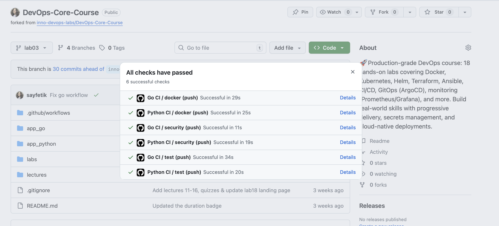
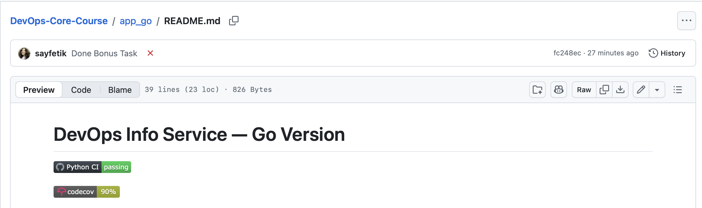
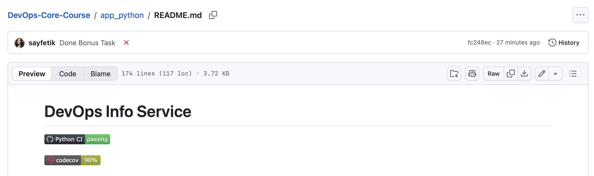
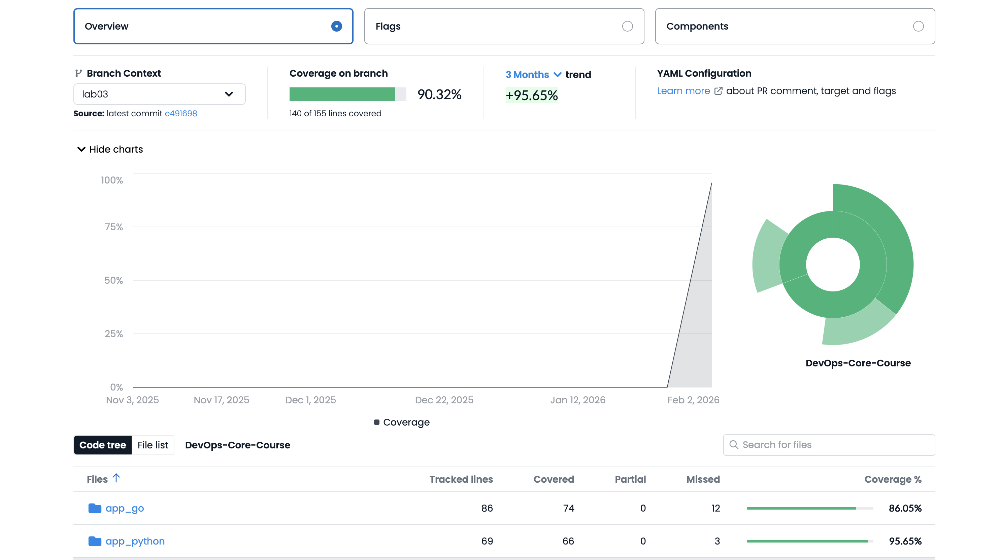

# Lab 3 Bonus — Multi-App CI & Coverage

## Second Workflow Implementation (Go)

The `.github/workflows/go-ci.yml` workflow is dedicated to the Go app. It includes:
- Path-based triggers (runs only on changes in `app_go/**` or the workflow file)
- Linting (`golangci-lint`)
- Testing (`go test`)
- Coverage report and threshold check (fails if coverage < 70%)
- Uploads coverage to Codecov
- Docker build/push with CalVer and latest tags
- Snyk security scan for Go modules

**Best practices:**
- Path-based triggers for efficiency
- Job dependencies (Docker waits for tests/lint)
- Versioning (CalVer)
- Security scanning
- Coverage threshold enforcement

## Path Filter Configuration & Testing Proof

**Python CI:**
```yaml
on:
	push:
		paths:
			- "app_python/**"
			- ".github/workflows/python-ci.yml"
```
**Go CI:**
```yaml
on:
	push:
		paths:
			- "app_go/**"
			- ".github/workflows/go-ci.yml"
```
**Testing proof:**
- Change only `app_python/` → only Python CI runs
- Change only `app_go/` → only Go CI runs
- Change both → both workflows run in parallel

## Benefits Analysis: Path Filters in Monorepos

Path filters prevent unnecessary CI runs, reduce resource usage, and speed up feedback by only running workflows for relevant changes. This is critical for monorepos with multiple apps.

## Example: Workflows Running Independently

- Push to `app_python/` triggers only Python CI
- Push to `app_go/` triggers only Go CI
- Both workflows can run simultaneously without blocking each other
- Actions tab shows separate runs for each workflow

## Output / Actions Tab Evidence

https://github.com/sayfetik/DevOps-Core-Course/actions/runs/21755758378
https://github.com/sayfetik/DevOps-Core-Course/actions/runs/21755758405

## Coverage Integration



https://app.codecov.io/gh/sayfetik/DevOps-Core-Course/tree/lab03


## Coverage Analysis

- **Go:** Current coverage: [86]% (see Codecov)
- **Python:** Current coverage: [95]% (see Codecov)
- Coverage threshold: 70% (CI fails if below)
- Not covered: error branches, startup code, trivial config
