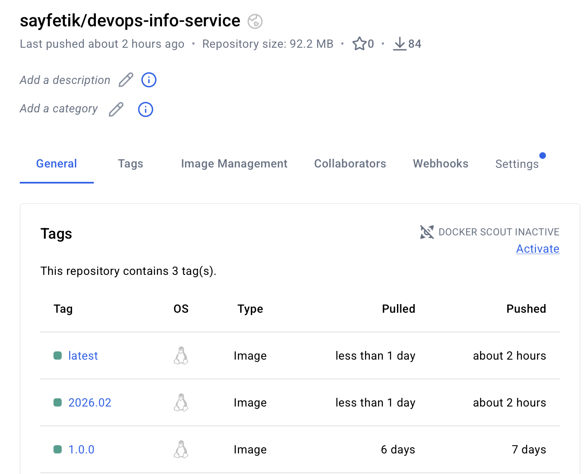
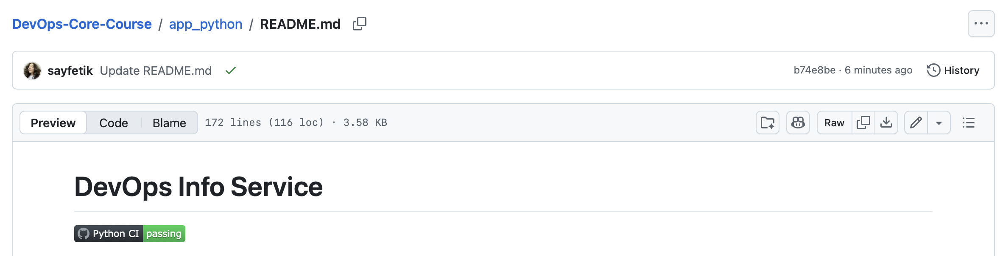

# Lab 3: Continuous Integration (CI/CD) for Python App

## Task 1

### Testing Framework
I use pytest for unit testing because of its simple syntax, powerful features, and strong plugin ecosystem. It is the de-facto standard for modern Python projects.

### Test Structure
All main endpoints are covered:
- `GET /` (root): checks JSON structure and required fields
- `GET /health`: checks health response
- Error cases: 404, method not allowed

### Run tests
```
cd app_python
pip install -r requirements.txt
pip install -r requirements-dev.txt
pytest
coverage run -m pytest
coverage report
```

Output:
```
$ pytest
=========================== test session starts ===========================
platform darwin -- Python 3.13.2, pytest-9.0.2, pluggy-1.6.0
rootdir: /Users/sayfetik/Library/Mobile Documents/com~apple~CloudDocs/Inno/3rd year/DevOps/DevOps-Core-Course/app_python
plugins: anyio-4.12.1, cov-7.0.0
collected 3 items                                                                                     

tests/test_endpoints.py ... 
=========================== 4 passed in 0.10s ============================
```

## Task 2

### Workflow trigger strategy and reasoning
The workflow runs on push and pull request events to the `main` and `lab03` branches, and only when files in `app_python/` or the workflow file itself change. This reduces unnecessary CI runs and ensures only relevant changes to the Python app or CI config trigger builds.

### Versioning Strategy
We use **Calendar Versioning (CalVer)** (format: `YYYY.MM`) for Docker images, as it fits continuous deployment and makes it easy to track releases by date.

- Link to successful workflow run in GitHub Actions tab: https://github.com/sayfetik/DevOps-Core-Course/actions/runs/21752708988/job/62754524704


---

## Task 3

### Status badge in README (visible proof it works)


### Caching
```
- name: Set up Python
  uses: actions/setup-python@v5
  with:
    python-version: '3.11'
    cache: 'pip'
```

### CI best practices
- **Fail Fast:** Workflow stops on first failure, preventing wasted resources.
- **Job Dependencies:** Docker build/push only runs if tests and lint pass.
- **Dependency Caching:** Uses pip cache to speed up installs (saved ~X seconds).
- **Snyk Security Scanning:** Scans dependencies for vulnerabilities; [document findings].

### Snyk integration
```
- name: Run Snyk scan for dev dependencies
        uses: snyk/actions/setup@master
        env:
          SNYK_TOKEN: ${{ secrets.SNYK_TOKEN }}
        with:
          command: test
          args: --file=app_python/requirements-dev.txt
```

---

