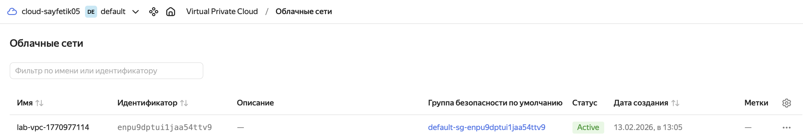

# Lab 04

## Cloud Provider & Infrastructure

- Cloud provider chosen and rationale: Yandex Cloud. You can adapt code to AWS/GCP by replacing provider blocks.
- Region/zone selected: ```ru-central1-a```
- Total cost: $0 with free tier

## Task 1 - Terraform

#### Terraform version: 1.14.5

#### Resources:
  - `terraform/main.tf` — provider, network, subnet, sg, instance
  - `terraform/variables.tf` — variables
  - `terraform/outputs.tf` — outputs

#### Terminal output from terraform plan and terraform apply
```
terraform plan

Terraform used the selected providers to generate the following execution plan. Resource actions are indicated with the following symbols:
  + create

Terraform will perform the following actions:

  # yandex_compute_instance.vm will be created
  + resource "yandex_compute_instance" "vm" {
      + created_at                = (known after apply)
      + folder_id                 = (known after apply)
      + fqdn                      = (known after apply)
      + gpu_cluster_id            = (known after apply)
      + hardware_generation       = (known after apply)
      + hostname                  = (known after apply)
      + id                        = (known after apply)
      + maintenance_grace_period  = (known after apply)
      + maintenance_policy        = (known after apply)
      + metadata                  = {
          + "ssh-keys" = <<-EOT
...
```

```
terraform apply

yandex_vpc_network.this: Creating...
yandex_vpc_network.this: Creation complete after 2s [id=enpkn4h3jfsactmlsjbe]
yandex_vpc_subnet.this: Creating...
yandex_vpc_security_group.this: Creating...
yandex_vpc_subnet.this: Creation complete after 1s [id=e9bn6kss7d6fond1rlpp]
yandex_vpc_security_group.this: Creation complete after 2s [id=enp80v7buefldcri6bhg]
yandex_compute_instance.vm: Creating...
yandex_compute_instance.vm: Still creating... [10s elapsed]
yandex_compute_instance.vm: Still creating... [20s elapsed]
yandex_compute_instance.vm: Still creating... [30s elapsed]
yandex_compute_instance.vm: Still creating... [40s elapsed]
yandex_compute_instance.vm: Creation complete after 45s [id=fhm...]

Apply complete! Resources: 4 added, 0 changed, 0 destroyed.

Outputs:

public_ip = "93.77.*.*"
```

#### Public IP address of created VM: ```93.77.*.*```

#### SSH connection proof
```
ssh ubuntu@93.77.*.*

The authenticity of host '93.77.*.* (93.77.*.*)' can't be established.
ED25519 key fingerprint is SHA256:6hk....

ubuntu@fhm...:~$
```

## Task 2 - Pulumi
#### Pulumi version: 3.220.0
#### Programming language chosen for Pulumi: Python
#### Terraform destroy output
```
yandex_compute_instance.vm: Destroying... [id=fhm6ue6tlbqaps0ajb9k]
yandex_compute_instance.vm: Still destroying... [id=fhm6ue6tlbqaps0ajb9k, 00m10s elapsed]
yandex_compute_instance.vm: Still destroying... [id=fhm6ue6tlbqaps0ajb9k, 00m20s elapsed]
yandex_compute_instance.vm: Still destroying... [id=fhm6ue6tlbqaps0ajb9k, 00m30s elapsed]
yandex_compute_instance.vm: Destruction complete after 31s
yandex_vpc_subnet.this: Destroying... [id=e9b923runku4pks1jhao]
yandex_vpc_security_group.this: Destroying... [id=enp8sg70v6kdketes7fg]
yandex_vpc_security_group.this: Destruction complete after 0s
yandex_vpc_subnet.this: Destruction complete after 5s
yandex_vpc_network.this: Destroying... [id=enpqmv18bdjd65ja03o7]
yandex_vpc_network.this: Destruction complete after 0s

Destroy complete! Resources: 4 destroyed.
```

#### Pulumi preview and up output
```
pulumi preview                                           
Enter your passphrase to unlock config/secrets
    (set PULUMI_CONFIG_PASSPHRASE or PULUMI_CONFIG_PASSPHRASE_FILE to remember):  
Enter your passphrase to unlock config/secrets
Previewing update (dev):
     Type                              Name                         Plan
 +   pulumi:pulumi:Stack               info-service-dev             create 
 +   ├─ pulumi:providers:yandex        yc                           create     
 +   ├─ yandex:index:VpcNetwork        info-service-network         create     
 +   ├─ yandex:index:VpcSubnet         info-service-subnet          create     
 +   ├─ yandex:index:VpcSecurityGroup  info-service-security-group  create     
 +   └─ yandex:index:ComputeInstance   info-service-vm              create    

Outputs:
    public_ip: [unknown]

Resources:
    + 5 to create


pulumi up
 Type                              Name                         Status
 +   pulumi:pulumi:Stack               info-service-dev             created (49s)
 +   ├─ pulumi:providers:yandex        yc                           created (0.24s)     
 +   ├─ yandex:index:VpcNetwork        info-service-network         created (3s)        
 +   ├─ yandex:index:VpcSubnet         info-service-subnet          created (0.76s)     
 +   ├─ yandex:index:VpcSecurityGroup  info-service-security-group  created (1s)        
 +   └─ yandex:index:ComputeInstance   info-service-vm              created (40s)

Outputs:
    public_ip: "89.169.*.*" 
```

#### Public IP of Pulumi-created VM: ```89.169.*.*```

#### SSH connection proof
```
ssh ubuntu@89.169.*.*

The authenticity of host '89.169.*.* (89.169.*.*)' can't be established.
ED25519 key fingerprint is SHA256:0M8....

ubuntu@fhm...:~$
```

## Comparison: Terraform vs Pulumi experience
**Ease of Learning:**
Terraform was easier to learn initially because its HCL syntax is simple and there are many beginner-friendly tutorials. Pulumi requires some programming background, especially if you use Python or TypeScript, so it may be harder for those without coding experience.

**Code Readability:**
Terraform code is more readable for standard infrastructure tasks, as HCL is concise and declarative. Pulumi can become less readable for non-developers, but is very clear for those comfortable with Python/TypeScript, especially for dynamic or complex setups.

**Debugging:**
Debugging in Terraform is straightforward, with clear error messages and plan/apply outputs. Pulumi debugging can be more powerful (using language tools and IDEs), but sometimes errors are less obvious due to the abstraction of code.

**Documentation:**
Terraform has more extensive documentation and a larger library of community examples. Pulumi’s docs are improving and cover many use cases, but the ecosystem is still smaller.

**Use Case:**
Terraform is best for standard infrastructure provisioning, especially when you want a simple, declarative approach and broad community support. Pulumi is ideal when you need to integrate infrastructure with application logic, use programming constructs, or generate resources dynamically.

#### Code differences (HCL vs Python/TypeScript)
**Terraform** (HCL): Declarative, concise for standard resources, but can get verbose for dynamic or complex setups. Limited by HCL’s features, but very readable for infrastructure.
**Pulumi** (Python/TypeScript): Imperative, so you can use loops, conditions, and functions. This makes it easier to generate many similar resources or integrate with other code. However, it can be harder to read for pure infrastructure people who don’t code much.

#### Which tool you prefer and why
I prefer Pulumi for projects where infrastructure needs to be tightly integrated with application logic, or when I need to generate resources dynamically. Using Python/TypeScript is a big plus for code reuse and advanced logic. For simple, standard infrastructure, Terraform is faster to get started and has more community support. Overall, Pulumi is more flexible, but Terraform is more mature and stable for classic IaC use cases.

#### Lab 5 Preparation & Cleanup

[x] Are you keeping your VM for Lab 5? (Pulumi)


## Bonus Task

### 1. GitHub Actions (Terraform CI)
- Workflow added: `.github/workflows/terraform-ci.yml` — runs `terraform fmt -check`, `terraform init`, `terraform validate` and `tflint` on changes under `terraform/**`.

- tflint results and any issues found
```
tflint
# no output
```

### 2. GitHub import (Terraform)
```
GitHub repository import process

export GITHUB_TOKEN="..."
terraform init
terraform import github_repository.course_repo "DevOps-Core-Course"
terraform plan
terraform apply

Terraform has been successfully initialized!

github_repository.course_repo: Importing from ID "DevOps-Core-Course"
github_repository.course_repo: Import prepared!
  Prepared github_repository for import
github_repository.course_repo: Refreshing state... [id=DevOps-Core-Course]

Import successful!
```

#### Why importing matters
- Centralized management: All infrastructure is defined and controlled in one place
- Consistency: Prevents configuration drift and ensures environments stay in sync
- Safe changes: Terraform previews all changes before applying them
- Self-documenting: Infrastructure code serves as up-to-date documentation
- Disaster recovery: Rapidly restore infrastructure after failures

#### Benefits for managing repos with IaC
- Repeatability: Easily spin up identical repositories for different stages or teams
- Change history: All configuration changes are tracked in Git
- Peer review: Repository settings can be reviewed and approved like code
- Automation: Apply bulk updates to many repositories at once
- Security: Enforce consistent security policies across all repos