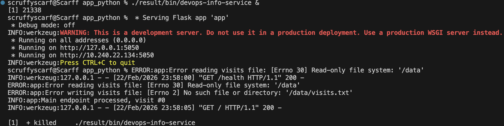

# Lab 18 — Reproducible Builds with Nix


## Build Reproducible Python App 

### Installation steps and verification output

```bash
curl --proto '=https' --tlsv1.2 -sSf -L https://install.determinate.systems/nix | sh -s -- install
```

```bash
info: downloading the Determinate Nix Installer
 INFO nix-installer v3.16.0
`nix-installer` needs to run as `root`, attempting to escalate now via `sudo`...
Password:
 INFO nix-installer v3.16.0
 INFO For a more robust Nix installation, use the Determinate package for macOS: https://dtr.mn/determinate-nix
Nix install plan (v3.16.0)
Planner: macos (with default settings)
...
 INFO Step: Install Determinate Nixd
 INFO Step: Create an encrypted APFS volume `Nix Store` for Nix on `disk3` and add it to `/etc/fstab` mounting on `/nix`
 INFO Step: Provision Nix
 INFO Step: Create build users (UID 351-382) and group (GID 350)
 INFO Step: Configure Time Machine exclusions
 INFO Step: Configure Nix
 INFO Step: Configuring zsh to support using Nix in non-interactive shells
 INFO Step: Create a `launchctl` plist to put Nix into your PATH
 INFO Step: Configure the Determinate Nix daemon
 INFO Step: Remove directory `/nix/temp-install-dir`
Nix was installed successfully!
To get started using Nix, open a new shell or run `. /nix/var/nix/profiles/default/etc/profile.d/nix-daemon.sh`
```

---

```bash
nix --version
```

```bash
nix (Determinate Nix 3.16.0) 2.33.3
```

### `default.nix`

- **Function signature**: Declares a function that accepts `pkgs`

- **Build mechanism**: Uses Python build helpers from Nix to package the app

- **Package metadata**: Defines name, version, and source inputs

- **Dependencies**: Lists required Python libraries

- **Build format**: Explicitly uses `setuptools`

- **Pre-build hook**: Generates `setup.py` before build starts

- **Post-install hook**: Creates a runnable script in `$out/bin/` and copies `app.py` into site-packages

- **Meta section**: Adds description, license, and supported platforms

### Store path consistency across builds

```bash
nix-build
```

```bash
/nix/store/...
```

---

```bash
nix-build
```

```bash
/nix/store/...
```

### pip install vs Nix derivation

| Aspect | pip + requirements.txt | Nix derivation |
|--------|------------------------|----------------|
| Python version | System-dependent | Pinned in nixpkgs |
| Direct dependencies | Pinned in `requirements.txt` | Pinned in nixpkgs |
| Transitive dependencies | Drift over time | Pinned via nixpkgs revision |
| Build reproducibility | Different versions possible | Bit-for-bit identical |
| Cross-machine consistency | Varies | Same hash guaranteed |
| Cache | pip cache (not content-addressed) | `/nix/store` |

### Why does `requirements.txt` provide weaker guarantees than Nix?

- Pins mostly direct dependencies
- Transitive dependencies can still change over time
- Python runtime may differ across machines
- `pip install` without hashes may resolve different artifacts
- Long-term reproducibility is not guaranteed

### App running from Nix-built version



### Nix store path format and what each part means

`/nix/store/<hash>-<name>-<version>`:

- **Hash**: SHA256 of all inputs (source, dependencies, build script)
- **Name**: Package name
- **Version**: Package version
- Same inputs -> same hash -> same store path

### Reflection

- **No "works on my machine" problems**

    - **pip**: Teams often debug environment drift between machines
    - **Nix**: Developers start from the same environment immediately

- **Dependency versioning**

    - **pip**: Usually tracks direct dependencies only
    - **Nix**: Locks Python version and full transitive dependency graph

- **Clean environments**

    - **pip**: Virtualenv can still conflict with host-level tooling
    - **Nix**: Provides isolated environments with deterministic inputs

- **Caching of assemblies**

    - **pip**: Rebuilds can reinstall many packages
    - **Nix**: Content-addressed cache makes repeated builds much faster

- **Documentation in the code**

    - **pip**: Version rules are often split between multiple files
    - **Nix**: `default.nix` captures build intent in one place


## Reproducible Docker Images

### `docker.nix`

- **Function entrypoint**: Accepts `pkgs` as input

- **Local bindings**: Uses `let` for reusable derivation variables

- **Application import**: Pulls app derivation from `./default.nix`

- **Image builder**: Uses `pkgs.dockerTools.buildImage`

- **Image metadata**: Sets name `devops-info-service-nix` and tag `1.0.0`

- **Base layer**: `fromImage = null` to build from scratch

- **Image contents**: Declares exactly what files and packages are included

- **Filesystem setup**: Adds directories and ownership rules via extra commands

### `Dockerfile` vs Nix `docker.nix`

| Aspect | Traditional Dockerfile | Nix dockerTools |
|--------|------------------|-----------------------|
| Base images | `python:3.9-slim` (can change over time) | No base image (pure derivations) |
| Timestamps | Usually differ across builds | Deterministic output |
| Dependency installation | `apt-get` + `pip install` steps | Declarative contents from store paths |
| Runtime artifact source | Built during image creation | Referenced from immutable Nix store |
| Reproducibility | Same Dockerfile can still produce different images | Same `docker.nix` produces identical images |
| Build caching | Layer-based (sensitive to layer invalidation) | Content-addressed caching |
| Image Size | 391.45MB with full base image | 1.6GB with minimal closure |
| Portability | Requires Docker | Requires Nix (then loads to Docker) |
| Security | Base image vulnerabilities | Minimal dependencies, easier auditing |

### SHA256 hash comparison proving Nix reproducibility

```bash
docker images devops-info-service-nix:1.0.0
```

```bash
sha256:30814fbcf817b93c5413170fb6ee0c32a28ac68bdadcf0b2ffad355aaafffd9c
```

---

```bash
nix-store --delete /nix/store/*
rm result
docker images devops-info-service-nix:1.0.0
```

```bash
sha256:30814fbcf817b93c5413170fb6ee0c32a28ac68bdadcf0b2ffad355aaafffd9c
```

### Image size comparison with analysis

- **Dockerfile**: 391.45MB
- **Nix dockerTools**: 1.6GB

**Nix image**:

- No mutable base image layer
- Includes only declared closure dependencies
- Python is part of the closure, not an ad-hoc runtime add-on

### `docker history`

```bash
docker history lab2-app:v1
```

```bash
IMAGE          CREATED          CREATED BY                                      SIZE      COMMENT
0df4ab8345f9   59 minutes ago   CMD ["python" "app.py"]                         0B        buildkit.dockerfile.v0
<missing>      59 minutes ago   HEALTHCHECK &{["CMD-SHELL" "curl -f http://l…   0B        buildkit.dockerfile.v0
<missing>      59 minutes ago   EXPOSE map[5050/tcp:{}]                         0B        buildkit.dockerfile.v0
<missing>      59 minutes ago   USER appuser                                    0B        buildkit.dockerfile.v0
<missing>      59 minutes ago   RUN /bin/sh -c mkdir -p /data && chown appus…   0B        buildkit.dockerfile.v0
<missing>      59 minutes ago   RUN /bin/sh -c useradd -m -u 1000 appuser &&…   23.6kB    buildkit.dockerfile.v0
<missing>      59 minutes ago   COPY app.py . # buildkit                        14.6kB    buildkit.dockerfile.v0
<missing>      59 minutes ago   RUN /bin/sh -c pip install --no-cache-dir -r…   17.3MB    buildkit.dockerfile.v0
<missing>      59 minutes ago   COPY requirements.txt . # buildkit              93B       buildkit.dockerfile.v0
<missing>      59 minutes ago   WORKDIR /app                                    0B        buildkit.dockerfile.v0
<missing>      59 minutes ago   RUN /bin/sh -c apt-get update && apt-get ins…   227MB     buildkit.dockerfile.v0
<missing>      3 months ago     CMD ["python3"]                                 0B        buildkit.dockerfile.v0
<missing>      3 months ago     RUN /bin/sh -c set -eux;  for src in idle3 p…   36B       buildkit.dockerfile.v0
<missing>      3 months ago     RUN /bin/sh -c set -eux;   savedAptMark="$(a…   42.8MB    buildkit.dockerfile.v0
<missing>      3 months ago     ENV PYTHON_SHA256=00e07d7c0f2f0cc002432d1ee8…   0B        buildkit.dockerfile.v0
<missing>      3 months ago     ENV PYTHON_VERSION=3.9.25                       0B        buildkit.dockerfile.v0
<missing>      3 months ago     ENV GPG_KEY=E3FF2839C048B25C084DEBE9B26995E3…   0B        buildkit.dockerfile.v0
<missing>      3 months ago     RUN /bin/sh -c set -eux;  apt-get update;  a…   3.86MB    buildkit.dockerfile.v0
<missing>      3 months ago     ENV LANG=C.UTF-8                                0B        buildkit.dockerfile.v0
<missing>      3 months ago     ENV PATH=/usr/local/bin:/usr/local/sbin:/usr…   0B        buildkit.dockerfile.v0
<missing>      4 months ago     # debian.sh --arch 'arm64' out/ 'trixie' '@1…   101MB     debuerreotype 0.16
```

---

```bash
docker history devops-info-service-nix:1.0.0
```

```bash
IMAGE          CREATED   CREATED BY   SIZE      COMMENT
30814fbcf817   N/A                    1.6GB
```

### Containers running simultaneously

```bash
docker ps
```

```bash
CONTAINER ID   IMAGE         COMMAND           CREATED             STATUS                       PORTS                    NAMES
b14353656bf4   devops-info-service-nix:1.0.0   "/nix/store/.../dev..."   About an hour ago   Up About an hour (healthy)   0.0.0.0:5052->5050/tcp   nix-container
1183a33d3a1c   lab2-app:v1   "python app.py"   About an hour ago   Up About an hour (healthy)   0.0.0.0:5051->5050/tcp   lab2-container
```

---

```bash
curl http://localhost:5051/health
curl http://localhost:5052/health
```

```bash
{"status":"healthy","timestamp":"2026-02-23T11:19:21Z","uptime_seconds":537}
{"status":"healthy","timestamp":"2026-02-23T11:19:23Z","uptime_seconds":539}
```

### Analysis

- Timestamps

    - Each Docker layer has a build-time timestamp
    - Matching content can still produce different hashes

- Base image tags

    - `FROM python:3.9-slim` uses a floating tag
    - The referenced image can change over time

- `apt-get install`

    - Pulls current package versions from repositories
    - Repository updates change build inputs

- `pip install`

    - Downloads wheels at build time
    - Wheel artifacts may vary across time or build settings

- Build context

    - `.dockerignore` changes what enters the context
    - Copy order affects cache and resulting layers

- Network

    - Different mirrors can return different artifacts
    - CDN behavior may influence downloaded content

### Reflection

- **Use Nix for Python dependencies**

    - **pip**: `requirements.txt` + `pip install`
    - **Nix**: Deterministic dependency resolution everywhere

- **Create a minimal image from the very beginning**

    - **pip**: `python:3.9-slim`
    - **Nix**: Build an image with only required runtime closure

- **Automate reproducibility testing**

    - **pip**: Detect drift before production deployment
    - **Nix**: In CI, verify that repeated builds keep the same hash

- **Document the dependencies in one place**

    - **pip**: Dependencies are often spread across multiple files
    - **Nix**: Captures build logic in one declarative source

- **Use assembly caching**

    - **pip**: Builds may redownload dependencies frequently
    - **Nix**: Binary cache significantly accelerates rebuilds

### Practical scenarios where Nix's reproducibility matters

- **CI/CD pipelines**: Builds should remain stable across repeated runs

- **Security audits**: Compliance needs exact versions, including transitive dependencies

- **Rollbacks**: Rebuild and redeploy any known-good revision reliably

- **Multi-team collaboration**: Local and CI environments stay aligned

- **Release engineering**: Supports long-lived and auditable release lines


## Modern Nix with Flakes

### `flake.nix`

- **inputs**: Declares external dependencies

- **outputs**: Defines the build outputs exposed by the flake

- **flake-utils.lib.eachDefaultSystem**: Produces outputs for multiple platforms

- **let ... in**: Holds local bindings for reuse

- **packages**: Exported build artifacts

- **apps**: Runnable application entries

- **devShells.default**: Reproducible development shell

### `flake.lock`

```yaml
...
"nixpkgs": {
    "locked": {
    "lastModified": 1751274312,
    "narHash": "sha256-/bVBlRpECLVzjV19t5KMdMFWSwKLtb5RyXdjz3LJT+g=",
    "owner": "NixOS",
    "repo": "nixpkgs",
    "rev": "50ab793786d9de88ee30ec4e4c24fb4236fc2674",
    "type": "github"
    },
    "original": {
    "owner": "NixOS",
    "ref": "nixos-24.11",
    "repo": "nixpkgs",
    "type": "github"
...
```

### `nix build`

```bash
warning: Git tree '/Users/sayfetik/DevOps-Core-Course' has uncommitted changes
```

### Builds are identical across time

```bash
nix build .
readlink result
```

```bash
/nix/store/lbc4c0r0q4pzclh0qlgp52yyxwphxvd6-devops-info-service-1.0.0
```

---

```bash
nix-store --delete /nix/store/lbc4c0r0q4pzclh0qlgp52yyxwphxvd6-devops-info-service-1.0.0
nix build .
readlink result
```

```bash
/nix/store/lbc4c0r0q4pzclh0qlgp52yyxwphxvd6-devops-info-service-1.0.0
```

### Dev shell experience

```bash
source venv/bin/activate
```

```bash
Python: 3.13.1 # depends on the system
Flask: 3.1.3 # can update
```

---

```bash
nix develop
```
```bash
Python: 3.12.3 # always the same
Flask: 3.0.3 # always the same
```

### `values.yaml` vs `flake.nix`

| Aspect | Helm `values.yaml` | Nix `flake.nix` |
|--------|---------------------------|---------------------|
| **Locks Python version** | Uses image Python | Pinned in flake |
| **Locks dependencies** | Only image tag | Exact hashes |
| **Locks build tools** | No | Yes |
| **Reproducibility** | Tag-based | Cryptographic |
| **Cross-machine** | Depends on image | Identical |
| **Dev environment** | No | Yes |
| **Time-stable** | Tags can change | Locked forever |

### Reflection

- **Complete closure**: Captures all dependencies, including toolchain components
- **Cryptographic verification**: Hashes provide integrity guarantees
- **Determinism**: Same inputs -> same outputs
- **Traceability**: Inputs point to exact upstream revisions
- **Dev/prod parity**: Development environment mirrors production assumptions

### Practical scenarios where `flake.lock` prevented a "works on my machine" problem

| Scenario | Without `flake.lock` | With `flake.lock` |
|----------|-------------------|-----------------|
| New developer joins the team | Full day of environment setup | A few minutes |
| Python version update | May break the application | No impact |
| CVE in transitive dependency | Unknown which version is used | Exact version is known |
| Deployment after a month | May fail to build | Builds identically |
| Dependency audit | Manual information gathering | Automatic from lock file |
